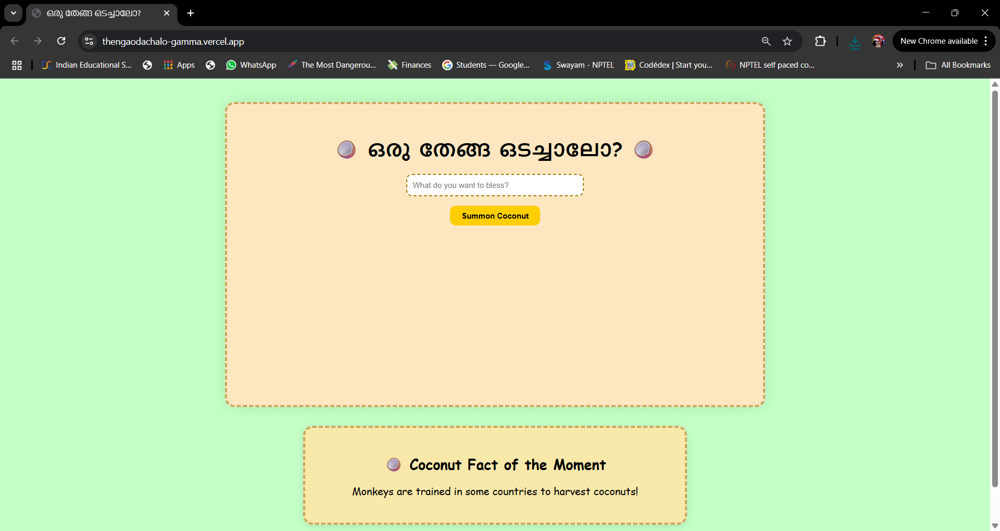
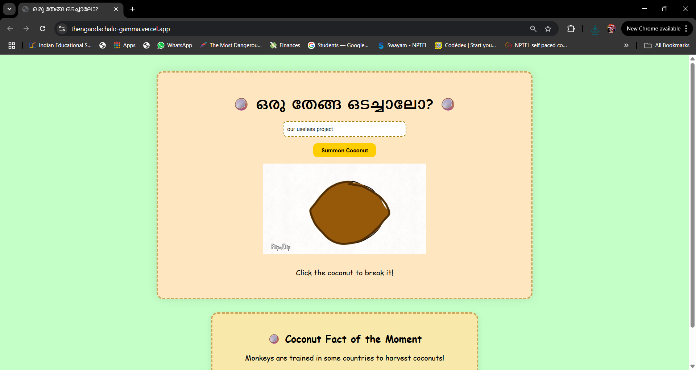
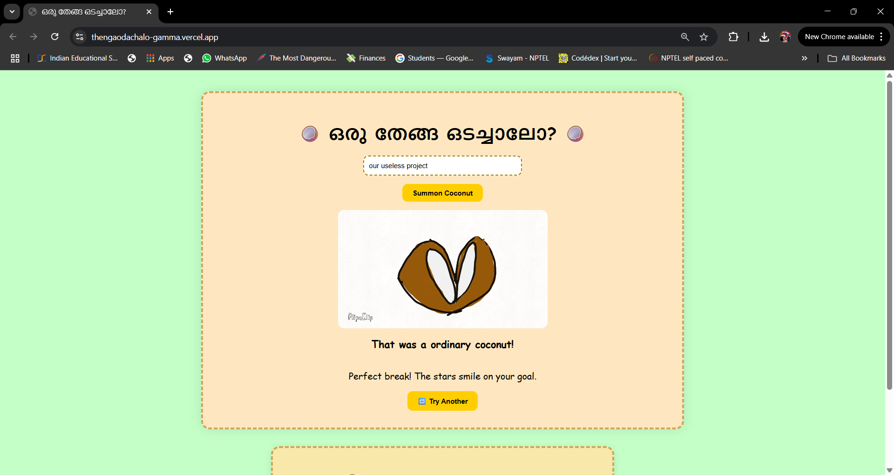

# [Project Name] 🎯Oru Thenga Odachalo?

## Basic Details
### Team Name: Techquila

### Team Members
- Team Lead: Reyna Mary John - Model Engineering College, Thrikkakara
- Member 2: Keerthana John - Model Engineering College, Thrikkakara

### Project Description
Feeling lucky? Break a coconut, bless your goals, and let fate decide! Each coconut holds a surprise—from perfect cracks to soap imposters and chocolate jackpots. A hilariously to test your fortune.

### The Problem (that doesn't exist)
What if you needed to break a coconut but dont have the strength or the coconut to break? 

### The Solution (that nobody asked for)
Voila this website thus solves all your problems and takes care of the divinaition for you. Also provides a wide variety of coconuts to keep your fortune seeking engaging and full of suprises

## Technical Details
### Technologies/Components Used
For Software:
- HTML, CSS, Javascript
- Visual Studio Code
- Git & GitHub for version control
- Flipaclip for animations

### Implementation
For Software:

# Run
(https://thengaodachalo-gamma.vercel.app/)

### Project Documentation
For Software:

# Screenshots (Add at least 3)

This is the homepage of the website! It has a form to ask for what exactly you want to bless, a button to summon a coconut and a random coconut fact at the bottom of the webpage!

After entering your project and pressing the button, a random coconut will be assigned to you!

To break the coconut, you have to click it. On clicking the image based on the coconut and an rng, you will get a certain possibility of the coconut actually breaking in half!

### Project Demo
# Video
[demo.mp4]
*This video shows you exactly how to use our website to bless your project(with good/bad fortune) *

## Team Contributions
- Reyna Mary John: Coding and the logic behind the code
- Keerthana John: Idea, code and visual components
---
Made with ❤️ at TinkerHub Useless Projects 

